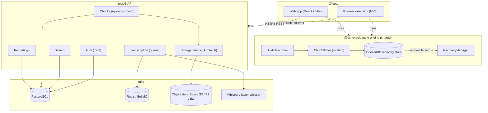
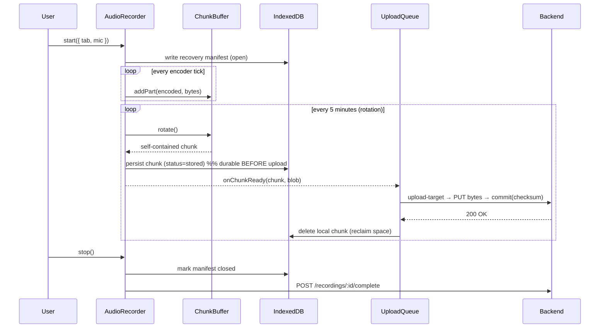
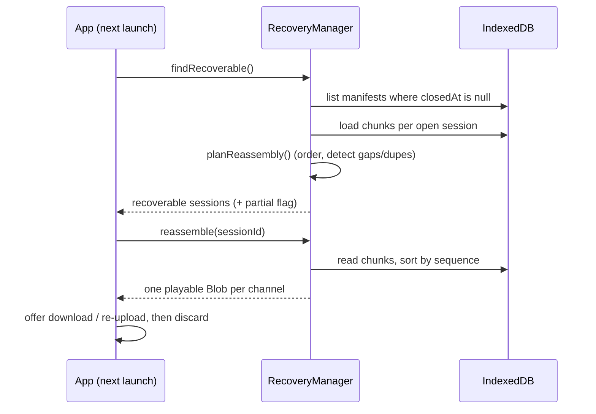

# EchoVault AI — Architecture

Audio is the source of truth. Every architectural decision optimizes for **never
losing a recording**, then for everything else.

## System overview



## The recording hot path

The hot path is deliberately short and never blocks on the network.



Key property: the only synchronous dependency for durability is **IndexedDB**.
Upload, commit, and the server are all downstream and fully retryable.

## Crash recovery



A session is "recoverable" if it has a manifest with no `closedAt` and at least
one stored chunk. Reassembly is tolerant: missing sequences are reported but the
surviving audio is still salvaged (`complete: false`).

## Why these choices

| Decision | Reason |
| --- | --- |
| **Stop/restart encoder per chunk** | Each chunk is an independently decodable file → trivial recovery, no header stitching. |
| **IndexedDB before upload** | Survives tab crash and full browser restart; the browser persists Blobs to disk. |
| **Chunks are the source of truth server-side** | Recording duration/size are _derived_ from committed chunks via `recomputeStats`, so they're always consistent with what actually arrived. |
| **Unique `(recording, channel, sequence)`** | Makes chunk commit idempotent — a retried upload can never duplicate. |
| **Encryption in `StorageService`, not the driver** | Every storage backend (local/S3) gets AES-256 at rest for free; drivers stay dumb byte stores. |
| **Engine shared by web + extension** | One audited capture/recovery implementation, two delivery surfaces. |
| **Transcription on BullMQ** | Fully decoupled from capture; can fail/retry/scale without ever touching audio. |

## Module map (backend)

```
src/
  config/            typed config + fail-fast env validation
  common/crypto/     AES-256-GCM + SHA-256 (pure util + Nest service)
  common/prisma/     PrismaService lifecycle
  auth/              JWT access/refresh, passport strategy, guards
  recordings/        lifecycle + derived stats (chunks = truth)
  chunks/            upload-target, raw ingest, idempotent commit, streaming
  storage/           driver abstraction (local/S3) + key safety + encryption
  search/            pure query builder + owner-scoped search
  transcription/     queue + worker + drivers (openai/local) + summarizer
  health/            liveness + DB readiness
```

## Performance

- The engine holds only the **current** chunk in memory (parts are flushed and
  the buffer empties on every rotation) — memory stays flat across a 12-hour
  session, satisfying the `<500 MB` target.
- Recording uses native `MediaRecorder` (hardware-accelerated Opus), so CPU is
  minimal during capture.
- Transcription (CPU-heavy) runs out-of-process on a queue, never on the hot
  path.
