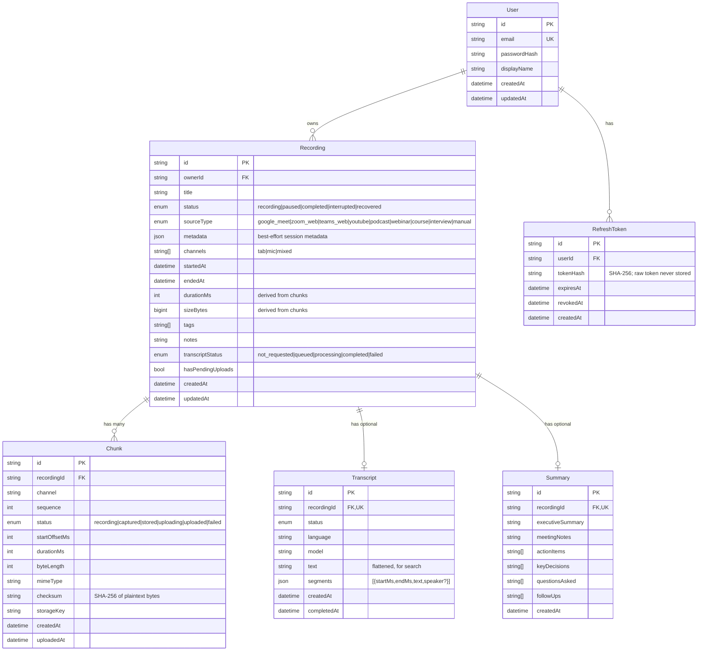

# EchoVault AI — Entity Relationship Diagram

The data model is generated from [`apps/backend/prisma/schema.prisma`](../apps/backend/prisma/schema.prisma).
`Recording` + `Chunk` are the durable record of captured audio; `Transcript` and
`Summary` are optional, secondary artifacts.

## Notable constraints & indexes

- `Chunk` has a **unique** `(recordingId, channel, sequence)` — the linchpin of
  idempotent uploads and duplicate-proof recovery.
- `Recording` is indexed on `(ownerId, startedAt)`, `(ownerId, sourceType)`, and
  `(ownerId, status)` for fast, owner-scoped library and search queries.
- `Transcript` and `Summary` have a **unique** `recordingId` (1:0..1).
- All children cascade-delete with their `Recording`/`User`.
- `durationMs` / `sizeBytes` on `Recording` are **derived** values recomputed
  from committed chunks (`RecordingsService.recomputeStats`), never trusted from
  the client.
